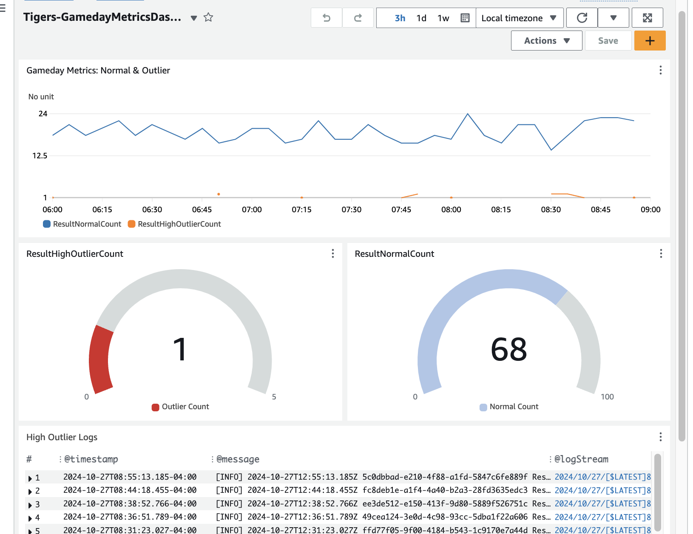

# ➤ bsc-gameday-tigers
BSC TacoCon 2024 Gameday Project

This project was our entry into the 2024 BSC Analytics TacoCon Competition.  The competition details were listed in the main repository: https://github.com/semperfitodd/bsc-gameday

### Solve this problem

Use a ML model to find outliers in the following areas:

* Log level
* Response time

You can use a home-grown model or any cloud managed models.

* AWS Sagemaker
* Azure Anomaly Detector
* DBSCAN
* Google Vertex
* Any other

### What we did

1. **Get access to the stream in a consumer**  
   Created a Kafka Consumer in Python and deployed it into our own namespace in EKS.  The consumer processes the stream and pushes it up to an AWS Lambda for processing

2. **Find a way to process logs in real time**
    The Lambda does a few things, it cleans the data and formats it into a way the inference endpoint expects.  Sends the record to sagemaker to be scored, returns the results to the consumer if you wanted to scrape pod logs, cloudwatch as a log output, and also sends scored data to sqs

3. **Find Outliers in the Data**
    We evaluated multiple models using both AWS and Databricks.  It was determined that using the Random Cut Forest in Sagemaker was the most appropriate for this event.

4. **Report on Outliers**
    Using cloudwatch metrics, and Dashboard we graph the detected anomaly over time.  We set a cloudwatch alarm to trigger if the number of anomalys breached a threshold.

5.  **Write the processed logs to S3 for further analysis**
     Using cloudwatch events, we trigger a lambda which writes the records from SQS to a file on S3 on a schedule. 

## Architecture Diagram

## Dashboard Example

## Conclusion
This project was a fun challenge to implement on the compressed timeline of the competition and the open endedness of the requirements.  